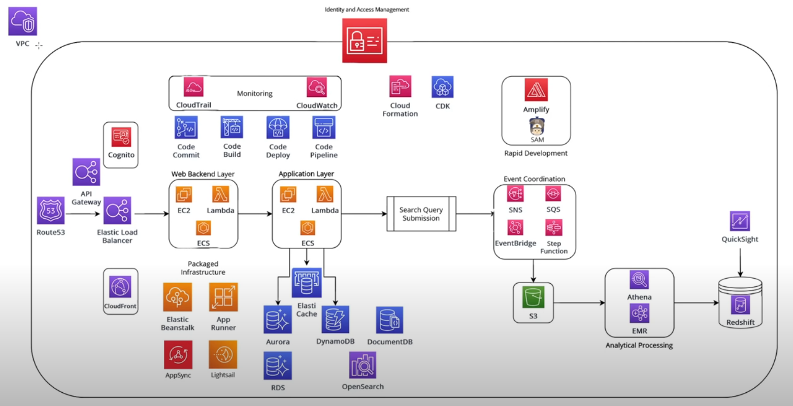

# AWS Services

---

---
### IAM (Identity and Access Management)
- Policy
  - Affect
  - Action
  - Resource
- Roles
- Users
  - Access Keys
  - Groups   
- [Truste Relationships](https://youtu.be/_ZCTvmaPgao?t=1015)

- Tips
  - Use the least privilege model
  - Effect "Deny" wins over "allow"   

---

### Links
- [AWS Services](https://www.youtube.com/watch?v=FDEpdNdFglI)
- [IAM](https://www.youtube.com/watch?v=_ZCTvmaPgao)
