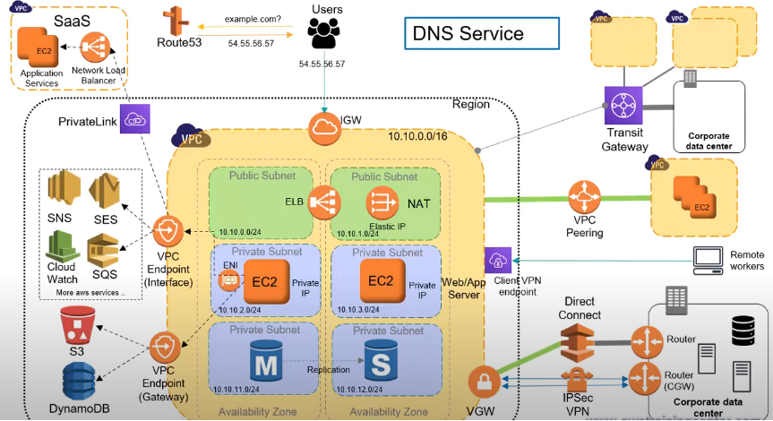

# AWS Services

---

[AWS Services](https://www.youtube.com/watch?v=FDEpdNdFglI)

---
### [IAM (Identity and Access Management)](iam/README.md)

---
### VPC Networking

- Region
- Router
- SubNets
- ELB
- NAT

[VPC](https://www.youtube.com/watch?v=XZbvQWkpJTI)

---

### Links
- [AWS Services](https://www.youtube.com/watch?v=FDEpdNdFglI)
- [IAM](https://www.youtube.com/watch?v=_ZCTvmaPgao)
- [VPC](https://www.youtube.com/watch?v=XZbvQWkpJTI)
