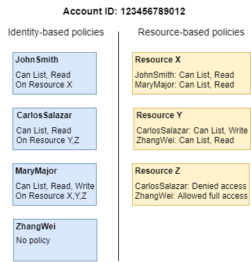

# [Voltar](../README.md)

# IAM
[Specification](https://docs.aws.amazon.com/IAM/latest/UserGuide/intro-structure.html)


- Roles
- Users
  - Access Keys
  - Groups
- [Policy](https://docs.aws.amazon.com/IAM/latest/UserGuide/reference_policies_evaluation-logic.html)
  - `Actions (or operations)` – The actions or operations that the principal wants to perform.
  - `Resources` – The AWS resource object upon which the actions or operations are performed.
  - `Principal` – The user, role, federated user, or application that sent the request. Information about the principal includes the policies that are associated with that principal. 
- [Identity-based policies and resource-based policies](https://docs.aws.amazon.com/IAM/latest/UserGuide/access_policies_identity-vs-resource.html)
- [Policy evaluation logic](https://docs.aws.amazon.com/IAM/latest/UserGuide/reference_policies_evaluation-logic.html)
- [Truste Relationships](https://youtu.be/_ZCTvmaPgao?t=1015)


- Tips
    - Use the least privilege model
    - Effect "Deny" wins over "allow"
- [Example Policies](https://docs.aws.amazon.com/IAM/latest/UserGuide/access_policies_examples.html)



### resource-based policy

- Attached to a resource 
```JSON
{
  "Version": "2012-10-17",
  "Statement": [
    {
      "Effect": "Allow",
      "Principal": {
        "AWS": "arn:aws:iam::123456789012:user/user001"
      },
      "Action": "s3:*",
      "Resource": [
        "arn:aws:s3:::bucket001/*",
        "arn:aws:s3:::bucket001"
      ]
    }
  ]
}
```


###  identity-based policies

- Attached to a identity (user, role, federated user, or application)
```JSON
{
  "Version": "2012-10-17",
  "Statement": [
    {
      "Effect": "Allow",
      "Action": "*",
      "Resource": "*"
    }
  ]
}
```


### link
[IAM](https://www.youtube.com/watch?v=_ZCTvmaPgao)
